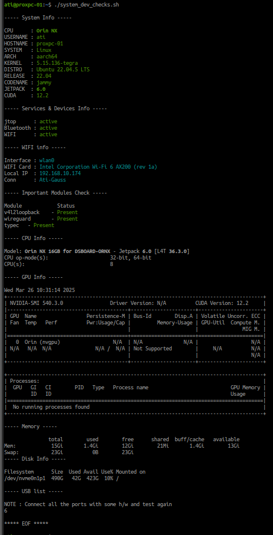

# After Unbox

This script is the first thing you should use after you unbox a new board. 
It'll check and give the outputs for all the necessary things which are 
required for ati motors board.
If any of the output is N/A or wrong you should reach to vendor and make them 
fix it.

