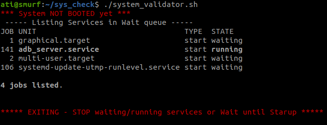
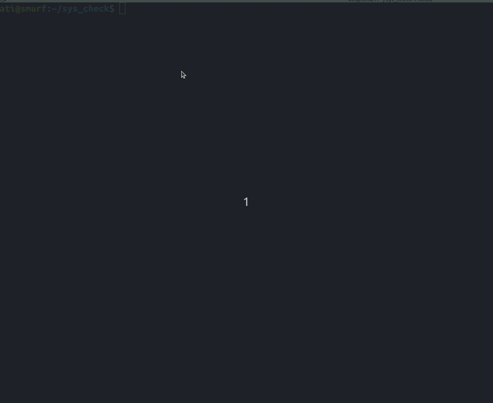
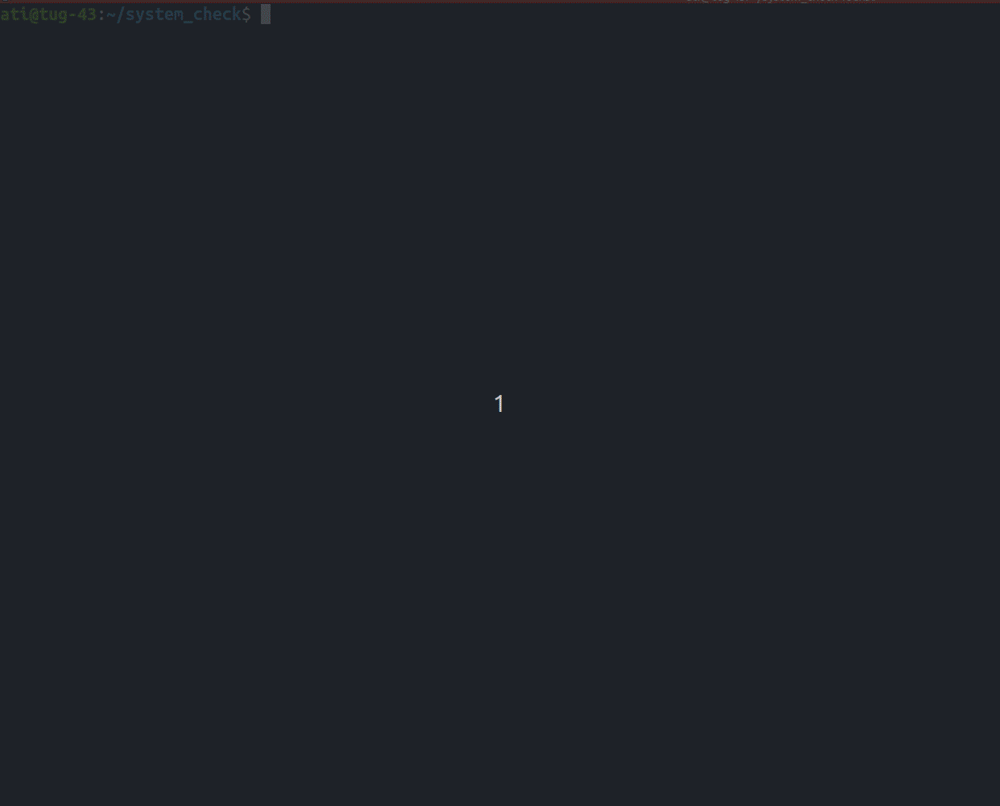

# System Validator & Stat Collector(SVSC)

> NOTE: This script has been tested on bot with usb count of 14 if there are more than 14 usb nodes change `USB_COUNT` in this script

`system_validator.sh` is a script which collects different logs and check for 
availabe hardware. This scprit generates a directory as `log_dir` where all the
logs are saved if you happen to run script multiple times this `log_dir` will be recreated every time you run this script.


This script will exit out if the System has not been booted properly so you might have to run this script again.

## Usage

1. Clone the Repo

```
git clone git@github.com:atipiyush/System_Validator.git
cd System_Validator
```

2. Run the script

Run `./system_validator.sh`

## POC

* If sytem is not booted up, following will be result of script



* Test performed on working bot `ati@smurf`



* Test performed on `test bed`



